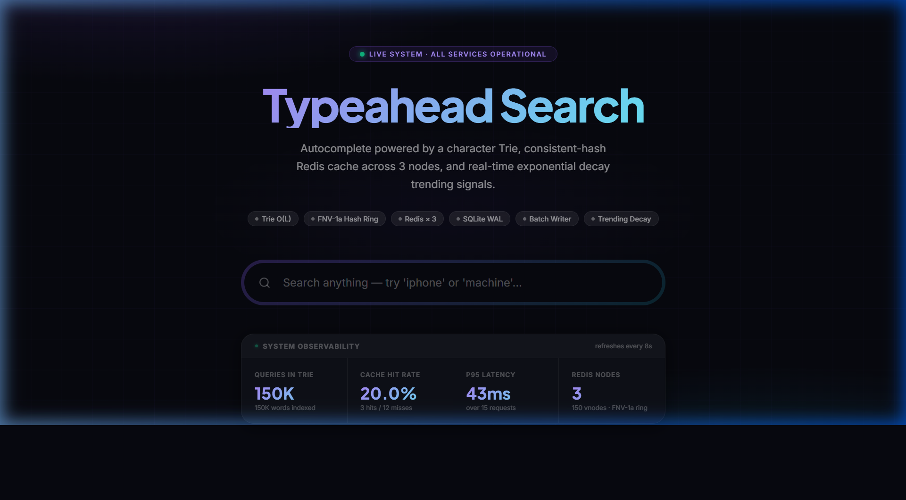
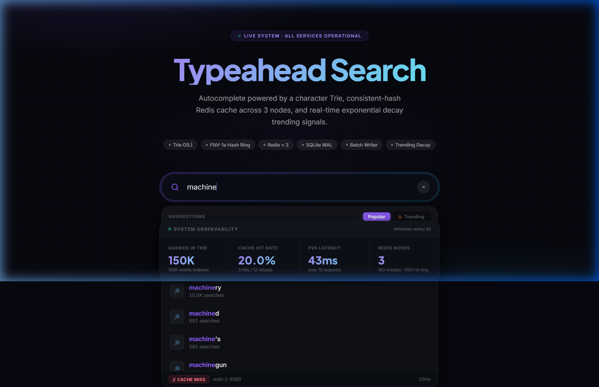

# Search Typeahead Autocomplete System

A full-stack, distributed search autocomplete system demonstrating a production-grade architecture with a character Trie index, consistent-hash Redis routing, asynchronous batch writes, and real-time trending signals.

---

## 📸 Interface Preview

### Home — System Observability Dashboard
A dark-mode UI with animated grid background, gradient typography, and a live metrics panel that refreshes every 8 seconds.



### Autocomplete Suggestions Dropdown
Cache hit/miss badges, the routing Redis node, and latency are shown live for every keystroke.



---

## 🛠️ Tech Stack

| Layer | Technology | Details |
|-------|------------|---------|
| **Frontend** | React 19 · Vite 5 · TypeScript | Dark glassmorphism UI, 280ms debounce, keyboard nav |
| **Backend** | Node.js · Fastify · TypeScript | Cache-aside pattern, p95 latency tracking |
| **Primary DB** | SQLite (`better-sqlite3`) | WAL mode, prepared statements, boot-time Trie load |
| **Cache** | Redis × 3 (Docker) | FNV-1a consistent-hash ring, 150 virtual nodes/node |

---

## ⚙️ Architecture

```
Browser (React / Vite — :5173)
        │  GET /suggest?q=app   POST /search { query }
        ▼
  ┌─────────────────────────────────────────────────┐
  │  Fastify Server  :3001                          │
  │                                                 │
  │  ┌──────────────┐   ┌─────────────────────────┐ │
  │  │  Trie (RAM)  │   │  BatchWriter (queue)    │ │
  │  │  150k nodes  │   │  flush every 5s / 200   │ │
  │  └──────┬───────┘   └──────────┬──────────────┘ │
  │         │ boot-load            │ periodic flush  │
  │         ▼                      ▼                 │
  │  ┌──────────────────────────────────────────┐   │
  │  │        SQLite  (typeahead.db)            │   │
  │  │   queries(query PK, count)               │   │
  │  │   trend_buckets(query, hour, count)      │   │
  │  └──────────────────────────────────────────┘   │
  │                                                 │
  │  ConsistentHashRing (FNV-1a, 150 vnodes each)   │
  │       ┌──────────┬──────────┬──────────┐        │
  │       ▼          ▼          ▼          │        │
  │  Redis:6379  Redis:6380  Redis:6381    │        │
  │  (Docker)    (Docker)    (Docker)      │        │
  └─────────────────────────────────────────────────┘
```

### Cache-Aside Flow (per `/suggest` request)

```
1. prefix → FNV-1a hash → clockwise ring walk → pick Redis node
2. GET "suggest:<prefix>:<mode>" from that node
3.   HIT  → return cached JSON            (typical: < 3ms)
4.   MISS → trie.getSuggestions(prefix) → SET TTL 60s → return
```

---

## 🚀 Setup & Running

### Prerequisites
- **Node.js ≥ 18**
- **Python ≥ 3.10** (for dataset ingestion)
- **Docker Desktop** (for the 3 Redis instances)

### 1. Install Dependencies
```bash
cd backend && npm install
cd ../frontend && npm install
```

### 2. Start Redis (Docker)
```bash
docker compose up -d
# Starts 3 Redis instances: ports 6379, 6380, 6381
```

### 3. Ingest Dataset (150K queries)
```bash
pip install wordfreq
python scripts/ingest_wordfreq.py
```

Verify:
```bash
sqlite3 backend/data/typeahead.db "SELECT COUNT(*) FROM queries;"
# Expected: 150000
```

### 4. Start Backend
```bash
cd backend
npm run dev
# Server ready at http://localhost:3001
```

### 5. Start Frontend
```bash
cd frontend
npm run dev
# UI ready at http://localhost:5173
```

---

## 🔍 API Reference

| Method | Endpoint | Description |
|--------|----------|-------------|
| `GET` | `/suggest?q=<prefix>&mode=count\|trending` | Top-10 autocomplete from Trie/Redis |
| `POST` | `/search` body: `{ query }` | Submit search, invalidate cache prefixes |
| `GET` | `/cache/debug?prefix=<x>` | Hash ring routing debug |
| `GET` | `/metrics` | p95 latency, hit rate, Trie size |
| `GET` | `/health` | System health check |

### `/suggest` Response Example
```json
{
  "suggestions": [
    { "query": "machinery", "count": 10512, "score": 6.98 }
  ],
  "meta": {
    "cacheHit": false,
    "node": "redis-2",
    "port": 6380,
    "latencyMs": 33
  }
}
```

---

## 💡 Key Design Decisions

| Decision | Trade-off |
|----------|-----------|
| **Trie in RAM** vs SQL `LIKE` | ~45MB memory for <1ms lookups (vs 100-200ms disk I/O) |
| **Consistent hashing** vs modulo | Node changes only re-shard ~1/N keys instead of 100% |
| **150 virtual nodes** per physical | Law of large numbers → ~33% load each, zero hotspots |
| **Cache-aside + 60s TTL** | Slight staleness for massive read throughput |
| **Batch writes** every 5s | Potential 5s data loss on crash vs. zero synchronous I/O penalty |
| **Alpha-beta decay trending** | Recent signals upweight new trends without erasing historical winners |

---

## 📊 Performance Profile

| Metric | Value |
|--------|-------|
| Trie boot time | ~450ms for 150K queries |
| Cache HIT latency | ~1–3ms |
| Cache MISS latency (Trie) | ~3–6ms |
| SQL fallback latency | ~110–220ms |
| Memory (Trie) | ~45MB |
| Ring distribution | ~33.3% per node (balanced) |